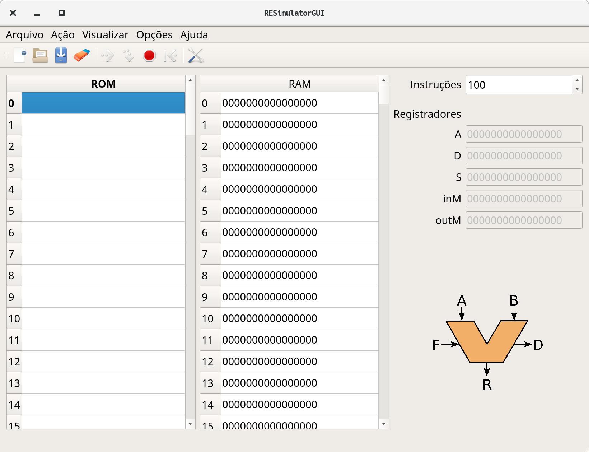
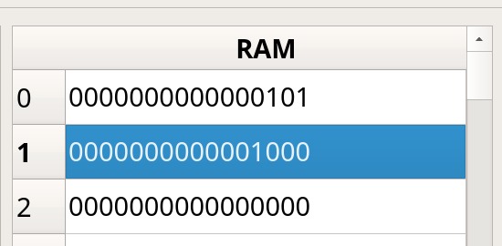
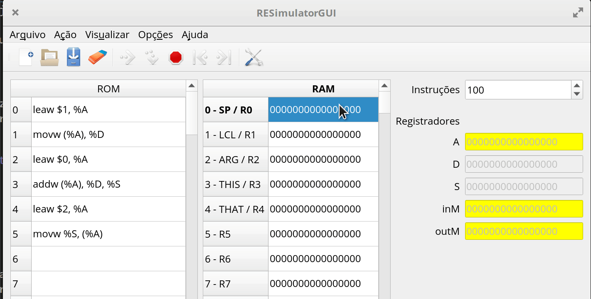

# Lab 11: (nasm) Assembly 

!!! info "💰 Laboratório com pontos"
    Algumas tarefas deste laboratório fornecem pontos de nota individual (hardware ou software), os exercícios marcados com 💰 são os que fornecem os pontos. Os pontos apenas são validados quando contabilizados pelo CI do github. Fiquem atentos para o deadline da entrega.
    
    Neste laboratório você pode receber até: **({{lab_11_points}})**.

Ao final desse lab você deve ser capaz de:

1. Usar o simulador gráfico 
1. Fazer pequenas modificações em um código assembly
1. Executar script de teste do assembly

!!! exercise
    Para executar qualquer laboratório você deve seguir os passos a seguir:

    1. Acesse o lab pelo link {{lab_11_classroom}} 
    1. Clone o repositório criado 
    1. Crie o ambiente virtual python (`python3 -m venv env`)
    1. Ative o ambiente virtual (`. env/bin/activate`)
    1. Instale as dependências (`pip3 install -r requirements.txt`)
    
!!! warning 
    Sempre que for abrir um terminal novo e acessar a pasta, será necessário ativar o ambiente virtual:
   
    ```
    . env/bin/activate
    ```

## Simulador

Nosso código assembly pode ser executado em hardware de verdade (FPGA) porém nesse primeiro momento iremos trabalhar em um ambiente simulado que nos dará maior facilidade de programação e depuração.

Um pouco de contexto: O livro texto (The Elements Of Computer System) disponibiliza um simulador da CPU original todo escrito em java, esse código é fechado e não permite nenhuma customização. Em 2017 o Prof. Luciano Pereira iniciou a criação de um simulador Z0 (versão anterior) também em Java, onde teríamos controle total do software.

Percebemos alguns pontos negativos de utilizar um simulador em Java sendo o principal: Qualquer alteração no Hardware iria demandar uma alteração no simulador, sendo necessário mantermos dois projetos independentes e sincronizados.

Nesta versão do curso iremos utilizar um simulador que utiliza uma implementacão em MyHDL como descrição da CPU (e de tudo envolvido), uma alteração no hardware irá automaticamente alterar o simulador e o comportamento do computador.

O simulador possui como entradas (para cada simulação): a arquitetura do computador (hardware); o conteúdo da memória RAM o conteúdo da memória ROM e um tempo de execução.

Após o término da simulação é exportado diversos sinais internos da CPU, o estado final da memória RAM e ROM. Esses sinais são então lidos pela interface gráfica e exibida de uma forma amigável, ou usados nos testes.

## Interface do Simulador 

O simulador possui a interface a seguir, onde a coluna da esquerda é referente a memória ROM (programa), a coluna da direita referente a memória RAM (dados). 



Toda vez que houver uma alteração em algum dos parâmetros do simulador (RAM/ROM/Instruções,...) o programa será novamente executado no simulador para obtermos um resultado atualizado. Isso pode dar a sensação de "lerdeza" mas lembre da complexidade do sistema: estamos executando um programa em um hardware inteiramente simulado no computador de vocês.


Para abrir o simulador digite no terminal:

```py
bits gui nasm
```

### Praticando

Abra o simulador e insira o seguinte código `nasm` (na parte referente a ROM), uma instrução por linha:

``` nasm
 leaw $1,%A         ; carrega a constant 1 em %A
 movw (%A),%D       ; move o valor da RAM[%A] para %D 
 leaw $0,%A         ; carrega a constant 0 em %A
 addw (%A), %D, %D  ; faz RAM[%A] + %D e salva em %D
 leaw $2, %A        ; carrega a constant 2 em %A
 movw %D, (%A)      ; copia o valor de %D para RAM[%A]
```

Esse código soma o valor que está salvo na memória RAM endereço 0 com o valor da memória RAM endereço 1 e salva no endereço RAM[2]:

```
RAM[2] = RAM[0] + RAM[1]
```

!!! tip "mov"
    A operação de `movw` não 'move' o dado de um lugar para outro, ela copia. O valor no destino não é apagado, por exemplo:
    
    ```nasm
    leaw $10, %A
    movw %A, %D
    ```
    
    Ao final dessas operações os registradores `%A` e `%D` possui o valor 10.

!!! tip "labels"
    **R0, R1, .., R15**, ... são nomes pré definidos de endereços de memória. O **R0** indica o endereço de memória 0, **R1** o endereço de memória 1 e assim por diante até o **R15**. O mesmo código pode ser escrito como:

    ``` nasm
      leaw $R1,%A            
      movw (%A),%D
      leaw $R0,%A
      addw (%A), %D, %D
      leaw $R2, %A
      movw %D, (%A)
    ```


Para testarmos esse código será necessário colocarmos valores iniciais na memória RAM para validarmos o nosso código, para isso altere a memória RAM como demonstrado a seguir:

- Endereço 0 = 5
- Endereço 1 = 8



!!! example "Executando"
    1. Com a memória alterada você pode agora executar a simulação
    1. Verifique se o valor da memória 2 é a soma dos endereços 0 e 1.
    1. Brinque com esses valores...

    

## Treinando

Vamos praticar um pouco agora programar em assembly, no começo parece bem difícil, mas com a prática as coisas vão ficando mais fáceis.

Use o resumo das instruções: [AssemblyZ1](https://insper.github.io/Z01.1/Z01/Util-Resumo-Assembly/) para saber as instruções disponíveis.

!!! exercise 
    Altere o código para armazenar o resultado no endereço RAM[5]
    
    ??? tip "Solução"
        ```nasm
        leaw $1,%A
        movw (%A),%D
        leaw $0,%A
        addw (%A), %D, %D
        leaw $5, %A        ; <- alterado essa linha para 5!
        movw %D, (%A)
        ```

!!! exercise 
    Altere o código para armazenar o negativo da operação entre RAM[0] + RAM[1] no endereço RAM[5] (dica: tem uma operação de `NEG`).
    
    ??? tip "solução"
        ```nasm
        leaw $1,%A
        movw (%A),%D
        leaw $0,%A
        addw (%A), %D, %D
        negw %D              ; aqui eu faço %D = - %D
        leaw $5, %A        
        movw %D, (%A)
        ```
    
## Script automático de testes

Além da interface gráfica do simulador, possuímos um script de teste automatizado (similar ao do MyHDL) que utiliza o pytest para executar testes no assembly. Esse script: `test_nasm.py` faz o seguinte:

1. Inicializa a memória RAM com valores pré estabelecidos 
1. Converte o `nasm` para `hack` e inicializa a memória ROM
1. Executa o Hardware por um tempo
1. Compara a memória RAM após a simulação com um padrão de testes.

Exemplo de teste:

```py
def test_add():
    ram = {0: 2, 1: 42}
    tst = {2: 44}
    assert nasm_test("add.nasm", ram, tst)

    ram = {0: 0, 1: 0}
    tst = {2: 0}
    assert nasm_test("add.nasm", ram, tst)

    ram = {0: 2, 1: 1}
    tst = {2: 3}
    assert nasm_test("add.nasm", ram, tst)
```

Onde:

- `ram`: É a memória RAM inicial da aplicação
- `tst`: É o teste que será executado na memória RAM ao final do processamento

### 💰 Praticando

Vamos implementar alguns códigos assembly, a descrição do que eles devem fazer estão no próprio arquivo `.nasm`.

!!! exercise
    - File: `add.nasm`
    - Test: `pytest -k add`
    
    Tarefa: Leia o cabeçalho do arquivo e implemente o programa nasm que executa o que está descrito, teste com o `pytest`

!!! exercise
    - File: `sub.nasm`
    - Test: `pytest -k sub`
    
    Tarefa: Leia o cabeçalho do arquivo e implemente o programa nasm que executa o que está descrito, teste com o `pytest`

!!! exercise "💰 ({{lab_11_points}})"
    - File: `mov.nasm`
    - Test: `pytest -k mov`
    
    Tarefa: Leia o cabeçalho do arquivo e implemente o programa nasm que executa o que está descrito, teste com o `pytest`
