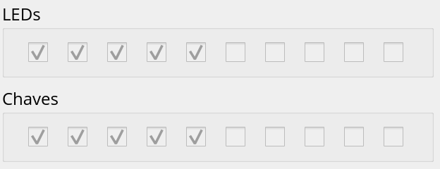
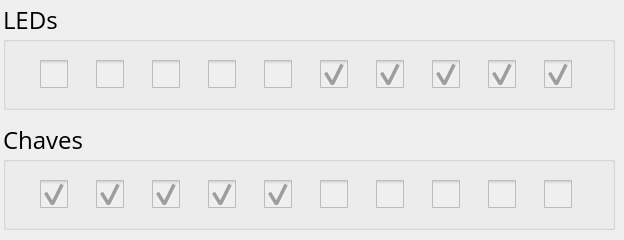

# Lab 11: (nasm) Periféricos

Ao final desse lab você deve ser capaz de:

1. Escrever nos LEDs do nosso Z01
1. Ler das chaves (SW) do nosso Z01
1. Escrever no LCD do nosso Z01

!!! tip
    Para fazer esse lab, você deve ter lido a teoria sobre [mapa de memória](https://insper.github.io/Z01.1/Teoria-Z01-mapadeMemoria/)

!!! note
    Dúvidas sobre assembly? [Z01->Resumo Assembly](https://insper.github.io/Z01.1/Util-Resumo-Assembly/)

Esse lab deve ser feito no Z01Simulador, para abrir o programa digitar `bits nasm gui` com o **env ativado!**

Todos os arquivos possuem teste, após programar no `Simulador` execute o teste

## LEDs

Problemas relacionados ao LED do nosso Z01

!!! exercise choice two-cols "Relembrando"
    Qual endereço de memória para acessar os leds do Z01?
    
    [](/commum-content/figs/Z0-mapa-de-memoria.svg)
    
    - [ ] 21186
    - [ ] 16383
    - [ ] 16384
    - [ ] 21183
    - [X] 21184
    - [ ] 21185

    !!! answer 
        - `21184`

!!! exercise "Led1"
    - File: `nasm/led1.nasm`
    - Test: Visual no simulador

    Faça o LED[0] acender, para isso execute o código a seguir no simulador:
    
    ``` nasm
    leaw $1, %A
    movw %A, %D
    leaw $21184, %A
    movw %D, (%A)
    ```
    
    {width=350}
        
!!! exercise "Led2"
    - File: `nasm/led2.nasm`
    - Test: Visual no simulador

    Faça os LEDs: 9,7,5,3,1 acenderem:
    
    {width=350}
        
    Dica: Você precisa escrever a palavra 0b`1010101010` nos LEDs, converta para decimal e carrega na CPU com `leaw`
        
### Executando no hardware

Para executar o código assembly na FPGA é necessário executar duas etapas:

1. Programar a FPGA com o nosso computador
1. Carregar a ROM com o programa em linguagem de máquina.

Para isso iremos usar o grupo de comandos `bits program`:

```
$ bits program
Usage: bits program [OPTIONS] COMMAND [ARGS]...

Options:
  --help  Show this message and exit.

Commands:
  fpga
  rom
```

!!! exercise
    Programando a FPGA:

    Conecte a FPGA no computador e execute o comando `bits program fpga`, esse comando irá transferir para a FPGA uma imagem do Z01 criado pelo seu professor.
 
    !!! info ""
        Uma vez programado a FPGA só será necessário executar esta etapa novamente se a placa for reiniciada.
 
!!! exercise
    Transferindo um programa:
    
    Agora com a FPGA programada com o hardware do nosso computador, podemos transferir um programa para a memória ROM, para isso utilize o comando `bits program rom` que pode receber arquivos do tipo: `.nasm`, `.hack` ou `.mif`.
    
    Execute: `bits program rom led2.nasm` e observe os LEDs da FPGA acenderem na mesma sequência do simulador.
    
    

## SW

Problemas relacionado a chave do nosso Z01

!!! exercise choice two-cols "Relembrando"
    Qual endereço de memória para acessar os leds do Z01?
    
    [](/commum-content/figs/Z0-mapa-de-memoria.svg)
    
    - [ ] 21184
    - [ ] 16383
    - [ ] 16384
    - [ ] 21183
    - [ ] 21184
    - [x] 21185

    !!! answer 
        - `21185`

!!! exercise "SW1"
    - File: `nasm/sw1.nasm`
    - Test: Visual no simulador
    
    Antes de iniciar a simulação, você deve configurar as chaves:

    {width=350}
    
    Task: Faça os LEDs serem o valor das chaves: LED = SW
    
    {width=350}
        
    ??? "resposta"
        ```nasm
        leaw $21185, %A
        movw (%A), %D
        leaw $21184, %A
        movw %D, (%A)
        ```

!!! exercise "SW2"
    - File: `nasm/sw2.nasm`
    - Test: Visual no simulador
    
    Antes de iniciar a simulação, você deve configurar as chaves:

    {width=350}

    Task: Faça os LEDs serem o contrário do valor das chaves: LED = !SW
    
    {width=350}
        
    Dica:  Utilize a instrução `notw %D` para inverter o valor  salvo no registrador `%D`

## LCD

Trabalhando com o LCD.

!!! exercise "LCD1"
    - File: `nasm/lcd1.nasm`
    - Test: Visual no simulador
 
    Task: Execute o arquivo no simulador o observe os 16 primeiros pxs acenderem  

    Dica: `movw $-1, (%A)`: Gera o vetor `1111111111111` e grava no endereço que %A aponta (primeiros pxs do LCD)

!!! exercise "LCD2"
    - File: `nasm/lcd2.nasm`
    - Test: Visual no simulador
 
    Task: Acione todos os pxs da primeira posição de memória do LCD, do meio do LCD e da última posição de memória do LCD.

    {width=350}

    Dica: O endereço central do LCD vocês podem calcular por:
        
    ```
    LCD = 320x240

    1. enderecos_porLinha    = 320/16 
                                = 20

    2. offset_linhaCentral   = 20*240/2
                                = 2400

    3. endereco_linhaCentral = 16384 + 2400
                                = 18784

    4. px_central            = 18784 + 10 
                                = 18794
    ```
