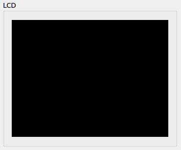
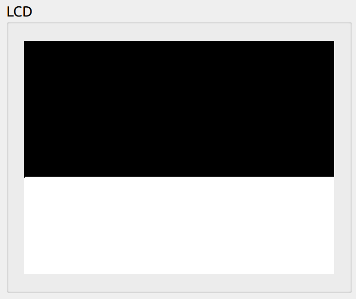

# Lab 13: (nasm) Saltos

Ao final desse lab você deve ser capaz de:

- Escrever programas complexos em assembly que envolvem acesso a memória e saltos (condicionais e incondicionais)

!!! tip
    Para fazer esse lab, você deve ter lido a teoria sobre:
    
    - [mapa de memória](https://insper.github.io/Z01.1/Teoria-Z01-mapadeMemoria/)
    - [jump](https://insper.github.io/Z01.1/Teoria-nasm-jump/)

!!! note
    Dúvidas sobre assembly? [Z01->Resumo Assembly](https://insper.github.io/Z01.1/Util-Resumo-Assembly/)

Esse lab deve ser feito no Z01Simulador, para abrir o programa basta digitar no terminal, `bits gui nasm` com o **env ativado!**

## Incondicional

!!! exercise "lcd1.nasm" 
    - File: `nasm/lcd1.nasm`
    - Test: Visual no simulador
    
    Task: Preencha todos os px do LCD de preto!
    
    
    === "resultado esperado"
        {width=350}
        
    === "solucão"
        
        Irei usar o RAM[0] para salvar o contador, que será incrementado a partir do endeço base do LCD `16384` até a onde o programa executar.
        
        > Neste exemplo, o valor final do loop não está sendo controlado!!
        
        ```nasm
        leaw $16384, %A
        movw %A, %D
        leaw $0, %A
        movw %D, (%A)
        
        LOOP:
          leaw $0, %A
          movw (%A), %D
          addw $1, %D, (%A)
          movw %D, %A
          movw $-1, (%A)
          leaw $LOOP, %A
          jmp
          nop
        ```

## Condicional

Saltos condicionais são utilizados para verificarmos condições no programa, vamos trabalhar um pouco com isso.


!!! exercise "jmp1.nasm" 
    - File: `asm/jmp1.nasm`
    - Test: Simulador ou `pytest -k jmp1`
    
    Implemente o pseudo código a seguir em nasm:
    
    ```python
    if RAM[1] == 0: 
        RAM[0] = 1
    else
        RAM[0] = 2
    ```
    
    === "configuração"
        Teste o programa com diferentes valores na RAM[1]:
        
        - Teste 1: RAM[1] = 3
        - Teste 2: RAM[1] = 0
        
    === "resultado esperado"
        - Teste 1: RAM[0] = 2
        - Teste 2: RAM[0] = 1
        
    === "dica"
        Podemos reescrever o código para ficar:

        ```python
        RAM[0] = 2
        if RAM[1] == 0: 
            RAM[0] = 1
        ```
    
    === "nasm"
    
        ```nasm
        leaw $2, %A
        movw %A, %D
        leaw $0, %A
        movw %D, (%A) ; RAM[0] = 2
        leaw $1, %A
        movw (%A), %D ; busca valor verificar (RAM[1])
        leaw $END, %A ; prepara salto
        jne           ; RAM[1] == 0?
        nop
        leaw $1, %A
        movw $1, (%A) ; RAM[=] = 1
        END:          
        ```
        
!!! exercise "jmp2.nasm" 
    - File: `asm/jmp2.nasm`
    - Test: Simulador ou `pytest -k jmp2`
    
    Implemente o pseudo código a seguir em nasm:
    
    ```python
    if RAM[1] == 3: 
        RAM[0] = 1
    else:
        RAM[0] = 2
    ```
    
    === "configuração"
        Teste o programa com diferentes valores na RAM:
        
        - Teste 1: RAM[1] = 3
        - Teste 2: RAM[1] = 0
        
    === "resultado esperado"
        - Teste 1: RAM[0] = 1
        - Teste 2: RAM[0] = 2
        
    === "dica"
        Não temos uma instrução de jmp que verifica se o valor de `%D` é igual a 3, porém podemos subtrair **3** do calor salvo em RAM[1] e verificar se o resultado é igual a 0:
        
        ```python
        RAM[0] = 2
        if RAM[1] - 3 == 0: 
            RAM[0] = 1
        ```
        
        ```nasm
        leaw $1, %A
        movw (%A), %D
        leaw $3, %A
        subw %D, %A, %D ; %D = RAM[1] - 3
        ```

!!! exercise "jmp3.nasm" 
    - File: `asm/jmp3.nasm`
    - Test: Simulador ou `pytest -k jmp3`
    
    Implemente o pseudo código a seguir em nasm:
    
    ```python
    if RAM[1] + RAM[2] >= 3: 
        RAM[0] = 1
    else
        RAM[0] = 2
    ```
    
    === "configuração"
        Teste o programa com diferentes valores na RAM:
        
        - Teste 1: RAM[1] = 1 / RAM[2] = 4
        - Teste 2: RAM[1] = 1 / RAM[2] = 1
        
    === "resultado esperado"
        - Teste 1: RAM[0] = 1
        - Teste 2: RAM[0] = 2

!!! example "jmp4.nasm" 
    - File: `nasm/jmp4.nasm`
    - Test: Visual
    
    Task: Acione a metade superior dos pxs do LCD de preto.
    
    {width=350}
