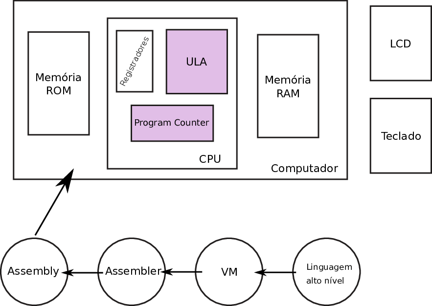
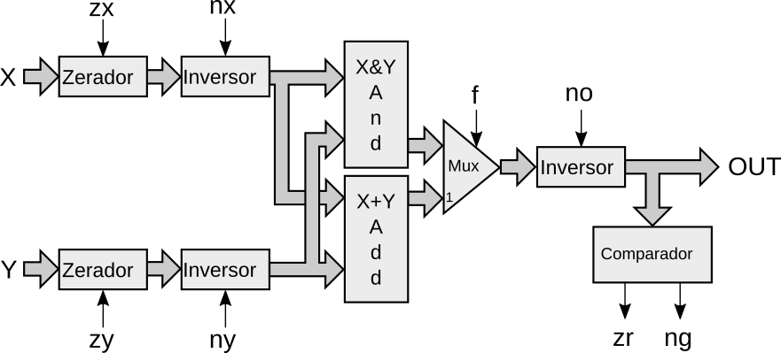

# C - ULA

| Entrega         |
|-----------------|
| 18/09 - Domingo |



Neste projeto seu grupo terá que desenvolver os componentes para a implementação de uma unidade lógica e aritmética (ULA) de 16 bit (proposta pelo livro texto) que será capaz de realizar operações binárias muito simples porém que possibilitará realizarmos muitas coisas!

!!! warning
    O grupo deve eleger um novo scrum master para essa entrega (diferente do projeto B).

!!! tip "Antes de começar"
    Siga os passos em:
    
    - https://insper.github.io/bits-e-proc/commum-content/util/Util-Comecando-novo-projeto/

!!! tip "Vixi Sou scrum master"
    Você é o scrum do projeto? Leia:
    
    - https://insper.github.io/bits-e-proc/commum-content/util/Util-vixi-sou-scrum/

!!! tip "Vixi! Sou desenvolvedor"
    Seu papel é o de desenvolvedor? Leia:
    
    - https://insper.github.io/bits-e-proc/commum-content/util/Util-vixi-sou-dev/

## Instruções 

Os arquivos referentes ao projeto são:

- `hw/ula.py`: Script python com os módulos a serem implementados
- `hw/test_ula.py`: Script de teste 

### Executando o Script de Teste 

Abra o terminal na pasta `hw` execute o pytest

```bash
$pytest test_ula.py
```

!!! tip
    Você pode usar o `-k MODULO` para executar apenas o teste o do módulo que deseja.

## Módulos 

Deve-se implementar os seguintes circuitos combinacionais:

- Add
    - **Modulo**   : `Add`
    - **Descrição** : Adiciona dois vetores de 16 bits resultando em um vetor de 16 bits (sem carry out do bit mais significativo - MSB).
    
- Inc
    - **Modulo**   : `Inc`
    - **Descrição** : Adiciona '1' a um vetor de 16 bits resultando em um vetor de 16 bits (sem carry out).
    - **Dependência**: `Add`
    
- Inversor 
    - **Modulo**   : `Inversor`
    - **Descrição** : Inverte um vetor de entrada quando o bit de controle **n** (nx ou ny) for igual a '1', e não modifica o vetor de entrada caso contrário. O resultado é um novo vetor de 16 bits.
    - **Dependência**: Não tem.
    
- Zerador
    - **Modulo**   : `Zerador`
    - **Descrição** : Zera um vetor de entrada quando o bit de controle **z** (zx ou zy) for igual a '1'. Não modifica o vetor de entrada se o bit for '0'. O resultado é um novo vetor de 16 bits.
    - **Dependência**: Não tem.
    
- Comparador
    - **Modulo**   : `Comparador`
    - **Descrição** : Verifica se o vetor de saída (16 bits) é igual a zero (**zr**) e se menor que Zero (**ng**). Caso igual a zero, faz com que o sinal **zr** seja igual a '1' e caso contrário '0'. Se o sinal de entrada for negativo faz com que **ng** receba '1' e '0' caso contrário.
    - **Dependência**: Não tem.
    
Pseudo código :

```python
if(a == 0):
  zr = 1
else:
  zr = 0
  
if (a < 0):
  ng = 1
else:
  ng = 0
```
    
- ALU
    - **Modulo**   : `ALU`
    - **Descrição** : A entidade que faz o mapeamento de todas as demais, interligando os blocos (zerador, comparador, inversor, Add ....) em um único bloco.
    - **Dependência**: `Comparador`, `Zerador`, `Inversor`, `Add`, 



## Testando em HW

Para testar os módulos em hardware, deve-se editar o `toplevel.py` configurando o módulo que deseja executar na FPGA.

## Entrega

A entrega **final** deve ser feita no ramo `master` do git.

- [ ] Implementar todos os módulos listados
- [ ] Todos os módulos devem passar nos testes
- [ ] Actions deve estar configurado e funcionando

## Rubrica

!!! warning
    Não fazer rubrica A e B na master, criar um novo branch para isso!

### C

- `add`
- `inc`
- `inversor`
- `zerador`
- `comparador`
- `ula`

- Testar na FPGA a ULA e gravar um vídeo dela funcionando.

### B - Nova topologia de somador (adder)

Entrega:

- `addcla4`: Somador de 4 bits do tipo carry-lookahead
- `addcla16`: Somador de 16 bits utilizando 4x `addcla4`
- `test_addcl4.py`: Teste para verificar o somador de 4 bits
- `test_addcl16.py`: Teste para verificar o somador de 16 bits

Para o conceito B vocês devem implementar um novo somador, com uma topologia diferente da realizada em sala de aula (que é chamado de `Ripple-carry adder`). O que vocês devem implementar agora é chamado de `Carry-lookahead adder`, que tem uma topologia que aumenta a velocidade na qual o resultado da adição é gerado.

Para isso deverão implementar dois módulos: `addcla4` que é um somador de carry lookahead de 4 bits e então usar quatro deste modulo para criar o `addcla16`:

| `addcla4`                                                                                                                                | `addcla16`                                                                                                                               |
|------------------------------------------------------------------------------------------------------------------------------------------|------------------------------------------------------------------------------------------------------------------------------------------|
|  |  |

Vocês encontram mais detalhes na wiki: https://en.wikipedia.org/wiki/Lookahead_carry_unit

- https://en.wikipedia.org/wiki/Carry-lookahead_adder
- https://en.wikipedia.org/wiki/Carry-lookahead_adder
`add`, existem várias topologias 

### A - Mais funcionalidades

Entrega:

- `ula_new()`: Nova ULA com a adição das funcionalidades.
- `bcdAdder(x, y, z)`: Somador de dois valores em BCD
- `test_bcdAdder()`: Teste do somador em BCD
- `test_ula_new()`: Teste da ULA modificada verificando as funcionalidades.
- Diagrama de blocos indicando a nova ULA (no `README.md` do repositório)

Aqui iremos adicionar mais funcionalidades a nossa ULA (mesmo que não precisando) e chamar-la de `ula_new`, para cada nova funcionalidades vocês devem implementar um novo teste, que:

- Valida individualmente o módulo
- Valida o módulo quando integrado na ULA

Os módulos devem ser integrados na `ula_new` e um diagrama fornecido indicando como os módulos foram utilizados na nova ULA.

!!! info "shift right/ left"
    Deve adicionar duas entradas ao controle da ula: `sr` (shift right) e `sf` (shift left) que deslocará o vetor de bits da  entrada X da ULA para direita ou esquerda Y vezes, sendo Y o valor da entrada Y da ula.
    
    Para esta nova operação vocês devem utilizar o `barrelShifter` da entrega anterior que recebe as entradas `x` e `y` a direção `dir` da rotação e resulta em um vetor de saída `z` com o resultado da operação.
    
!!! info "BCD adder"
    Iremos considerar que a nossa ULA pode tratar as entradas X e Y como números em BCD e pode realizar uma operação de soma entre eles. Para essa operação vocês devem criar um novo módulo `bcdAdder(x, y, z)` que recebe dois vetores de entrada `x` e `y` e resulta em um novo vetor `z` que é a soma em BCD dos valores.
    
    Exemplo: `x=1000, y=1000 ==> z=0001_0110`
    

