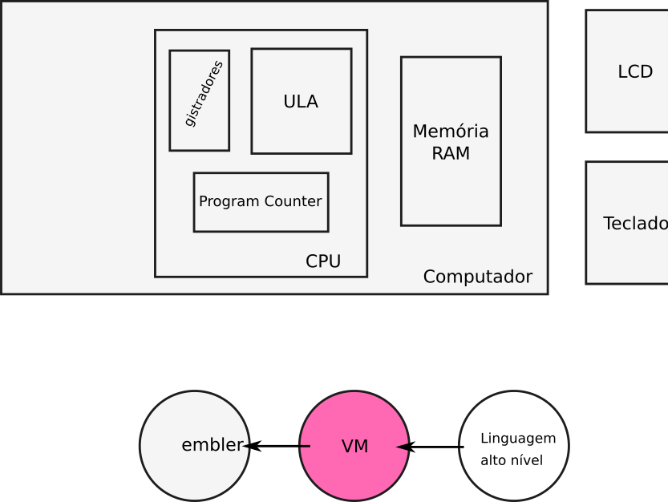

# H - VM translator

| Entrega      |
|--------------|
| 23/11 - Quarta |

[width=500]

Nesse projeto iremos criar o programa *vmtranslator* que é responsável por traduzir os comandos de pilha em Assembly.

## Instruções 

As instruções técnicas de como começar o projeto estão no laboratório vm.

## Rubrica

Rubrica para a entrega:

### Conceito C

| test                          |
|-------------------------------|
| `pytest test_code_arithmetic` |
| `pytest test_code_pop`        |
| `pytest test_code_push`       |

- `writeArithmetic`
- `writePop`
- `writePush`

### Conceito B

| test                       |
|----------------------------|
| `pytest test_code_goto` |

- `writeLabel`: Escreve um label em assembly quando encontra algo como `label end`
- `writeGoto`: Escreve um salto incondicional em assembly quando encontra `goto end`
- `writeIf`: Escreve um salto condiciona em assembly quando encontra `if-goto end`

O teste `test_code_goto.py` depende do conceito C e também ele testa os três comandos ao memso tempo: `writeLabel`, `writeGoto` e `writeIf`.

### Conceito A

| test                       |
|----------------------------|
| `pytest test_code_function` |

- `writeCall`: Faz a chamada de uma funcão, isso envolve salvar o frame na pilha e alterar os ponteiros
- `writeReturn`: Faz o retorno de uma funcão (recupera frame e os ponteiros)
- `writeFunction`: Reserva na pilha enderecos para as variáveis locais

O teste faz uma chamada de funcão e verifica se o resultado está correto.
