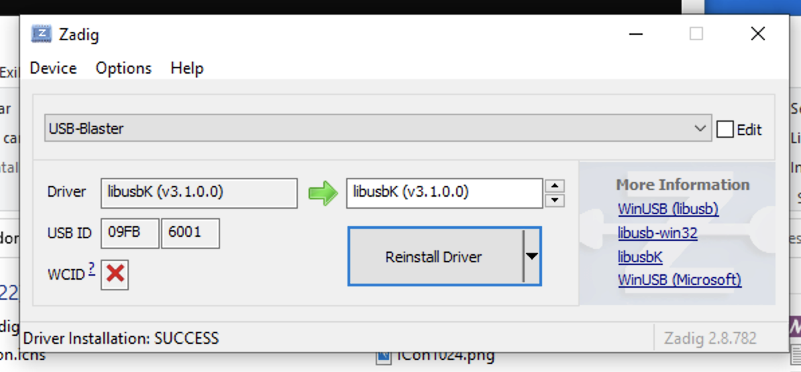
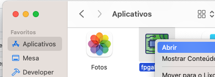

# Configurando a Infra

!!! info
    Não será mais necessário o uso do docker, vamos usar o github codespace!
    
## 1.Codespace

Para cada laboratório ou para os projetos iremos possuir um repositório no github que foi configurado para rodar o container (docker) na nuvem, vocês não vão precisar mais instalar o docker local.

## 2. FpgaLoader

Faca o download do programa que facilita a programação da FPGA (desenvolvido internamento pelo Eduardo Marossi):

- https://github.com/Insper/fpgaloader/releases

E com a FPGA plugada no computador execute o programa.

=== "Usuários Windows"

    Vocês vão precisar baixar também o programa Zadig (está também no github, em releases). Executem o Zadig, e pluguem a placa, deverá aparecer "USB Blaster II", escolha o driver "libusb-K" conforme a imagem e clique em "Install Driver". Em seguida pode prosseguir abrindo o programa "fpgaloader"

    
    
=== "Usuários macOS (M1/M2 ou Intel)"

    Baixem a versão apropriada para o seu macOS, se você tem M1 ou M2 baixe a versão aarch64. Caso seja Intel baixe a versão x86_64. Descompacte e arraste o aplicativo fpgaloader para pasta Applications no seu macOS. Para abrir a primeira vez, será necessário clicar com o botão direito do mouse em cima do executável, e clicar em "Abrir".

    

=== "Usuários Linux"
    Executem o comando com `sudo` por conta do acesso ao USB.

## 5. Testando

!!! exercise
    1. Criei um repositório usando o [classroom]({{infra_test_classroom}})
    2. Clone o repositório para a sua máquina

=== "Codespace"
    !!! video
        

=== "FPGA"
    !!! video
        

No terminal do codespace, execute:

1. `pytest -s` para testarmos a instalação python
1. `make toplevel.rbf` para testarmos a parte de compilação e programação da FPGA.

Agora com a FPGA plugada no computador:

1. Abra o programa `fpgaLoader`
1. Os scripts devem ter gerado um arquivo chamado `toplevel.rbf`, faca o download arquivo e carregue no programa `fpgaloader`.

Agora você deve observar que os LEDs da FPGA piscam.
