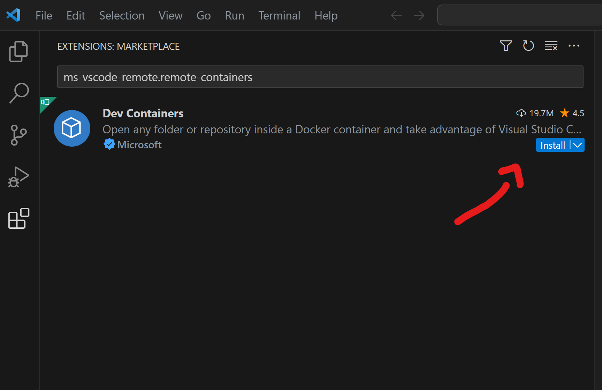

# Configurando a Infra

Vamos configurar os softwares que usaremos para desenvolver o nosso processador. Para isso teremos que:

1. Ter o Vscode instalado
1. Configurar um pacote python (telemetry)
1. Instalar docker
1. Instalar o FPGALoader
1. Teste

## 1. VScode

Vamos usar o vscode para fazer todo o desenvolvimento da matéria, e iremos usar uma extensão especifica chamada: **Dev Containers**:


1. Abra o VSCode e pressione **Ctrl + Shift + X** para abrir o Extensions
2. Pesquiste por **ms-vscode-remote.remote-containers** e instale o mesmo, conforme a imagem abaixo:



## 2. Telemetry

Primeiro vamos configurar o plugin de telemetria (python), uma coleta de dados que fazemos em algumas disciplinas, os dados são usados anonimamentes a fim de entender e melhorar as dinâmicas de sala de aula.

No terminal do Vscode execute:

```bash
pip3 install git+https://github.com/insper-education/telemetry-pytest
```

E depois de instalado o pacote, execute:

```
telemetry auth
```

!!! info
    Isso ira abrir um navegador que você devera logar com sua conta do github e então o sistema irá gerar um token, que deve ser **colado no terminal**. 
	


## 3. Docker

A infraestrutura da disciplina utiliza Docker para rodar containers com imagens padronizadas com todas as ferramentas
instaladas e configuradas, de forma a ser mais prático, rápido e eficiente para o desenvolvedor.

Atualmente, containers é uma forma altamente popular e consolidada no mercado de software para distribuir sistemas, softwares, ambientes de desenvolvimento de forma padronizada.

=== "Windows"
    Para o docker funcionar no Windows é necessário instalar primeiro o WLS.

    ### WSL2

    Abra o Command Prompt como administrador, encontre no menu iniciar, botão direito "Executar como administrador" e verifique a versão do Windows 10 instalada, através do comando `ver`. Você deverá ver algo como `10.0.xxxxxx`, sendo xxxxx a build do Windows, você precisa estar com 18362 ou superior. Se você tiver Windows 11, você não precisa verificar, visto que todas versões suportam o WSL2.

    1. Instale o WSL2 (Windows Subsystem for Linux): `wsl --install`
    2. Se você já tiver ele instalado, garanta que esteja atualizado: `wsl --update`
    3. Para garantir que o WSL rode sempre na versão 2, rode o comando: `wsl --set-default-version 2`

    ### Docker

    Agora, entre no site oficial do Docker, [https://www.docker.com](https://www.docker.com), e faça o download da última versão para Windows.

    1. Execute o instalador e siga os passos padrões, sem mistério.

=== "Mac OS (Intel ou ARM)"

    Antes de começar, assegure-se de que seu sistema operacional é macOS na versão Big Sur (11) ou superior (como Monterey, Ventura, etc.). Para usuários do Mac com chipset M1, não se preocupe, todos são compatíveis.

    1. Acesse o [site oficial do Docker](https://docs.docker.com/desktop/install/mac-install/) e baixe o aplicativo Docker. Importante: existem duas versões para macOS, x64 e M1. ==Certifique-se de escolher a correta para o seu Mac==.
    2. Execute o instalador e siga as instruções apresentadas.
    3. Uma vez instalado, abra o aplicativo Docker. Você pode localizá-lo na pasta 'Aplicativos' ou buscar no Spotlight usando o atalho Command+Space.

=== "Linux (Ubuntu)"

    1. No terminal, instale o Docker utilizando o seguinte comando:

    ```bash
    sudo snap install docker
    ```

    2. Habilite as permissões necessárias para o seu usuário:

    ```bash
    sudo addgroup --system docker
    sudo adduser $USER docker
    newgrp docker
    sudo snap disable docker
    sudo snap enable docker
    ```


## 4. FpgaLoader

Faća o download do programa que facilita a programacão da FPGA (desenvolvido internamento pelo Eduardo Marossi):

- https://github.com/Insper/fpgaloader/releases

E com a FPGA plugada no computador execute o programa.

!!! warning "Usuários Linux"
    Executem o comando com `sudo` por conta do acesso ao USB.

## 5. Testando


!!! exercise
    1. Criei um repositório usando o [classroom]({{infra_test_classroom}})
    2. Clone o repositório para a sua máquina
    
E abra a pasta recém clonada no Vscode e carregue o projeto no contêiner executando o comando **Open Folder in Container**:


No terminal:

1. Execute `pytest` para testarmos a instalacão python
1. Execute `make toplevel.rbf` para testarmos a parte de compilação e programacão da FPGA.

Os scripts devem ter gerado um arquivo chamado `toplevel.rbf`, arraste o arquivo para o programa `fpgaloader`.

Agora você deve observar que os LEDs da FPGA piscam.
