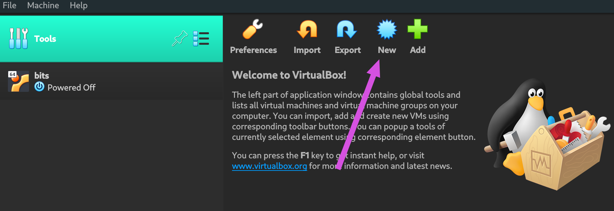
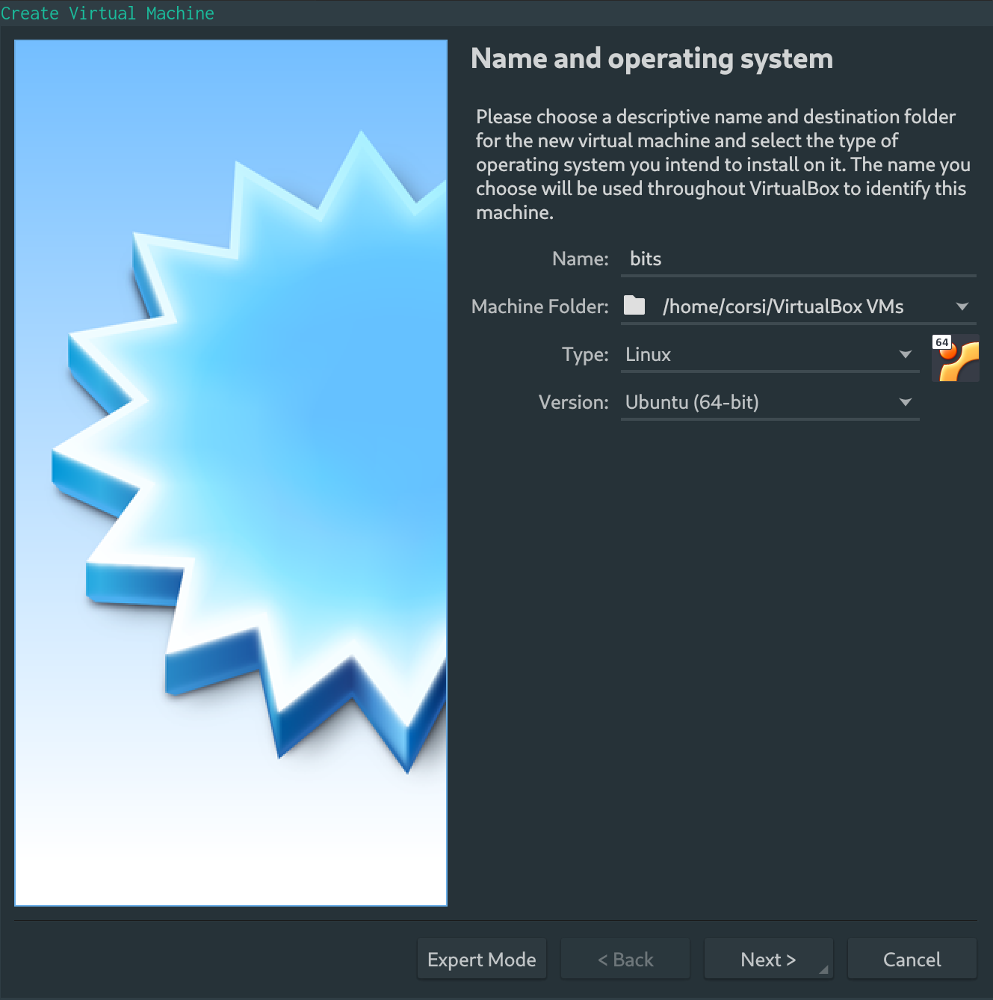
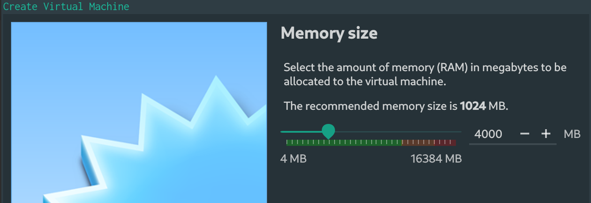
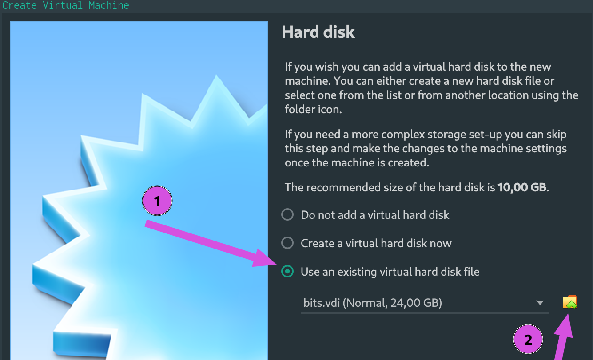

# Infra

A matéria foi desenvolvida e testada para funcionar em unix, mais especificamente no ubuntu 21.04. Para não perdemos tempo com a configuracão do sistema operacional e possíveis problemas com versões distintas, iremos trabalhar nas entregas e laboratórios em uma Máquina Virtual (VM), que já possui tudo configurado e testado (*espero eu*).

A VM foi desenvolvida com as seguintes configuracões:

- Lubuntu 21 (*Ubuntu com LXDE*)
- Python 3.8
- Intel Quartus Lite 21.1 
    - Já com a parte do programador funcionando
    - `bashrc` configurado
- VsCode

!!! warning
    Professor eu já uso linux, preciso mesmo assim da VM? **SIM**. Eu não quero perder de aula configurando infra, se você quiser fazer por conta tudo bem, mas não durante a aula.


## Usando

Primeiro instale o software VirtualBox.

=== "Ubuntu"
    ```
    sudo apt-get install virtualbox
    sudo apt-get install virtualbox—ext–pack
    ```
=== "Windows"
    Faca o download e instale:
    
    - https://download.virtualbox.org/virtualbox/6.1.36/VirtualBox-6.1.36-152435-Win.exe 
=== "MAC"
    M1? Ai lascou.. não sei se vai funcionar. Precisamos testar.
    
    Se for intel x86 você pode usar o virtualbox:
    - https://download.virtualbox.org/virtualbox/6.1.36/VirtualBox-6.1.36-152435-OSX.dmg

Agora baixe o arquivo de disco `bits.vdi` (20G) para o seu computador, se não tiver espaço disponível podemos emprestar um pendrive ou SSD (fale com o Will ou com o Marco).

!!! tip
    1. O download só vai funcionar conectado na rede Insper.
    1. O Will ficou com uma cópia no pendrive que é mais rápido. Se não quiserem esperar 30min falem com ele!

!!! exercise
    Download do arquivo [bits.vdi](http://10.103.11.93/bits/)
    
    - http://10.103.11.93/bits/

Com o download feito, abra o virtualbox e siga os passos a seguir:




!!! info
    Indicamos 4G de RAM ou mais, não utilize mais que 50% da memória disponível no seu PC.



Agora vamos fazer a VM utilizar a imagem de disco que foi baixada, na etapa 2 você deve localizar o `bits.vdi`.



Inicializando a VM:


## Logando

Ao inicializar a VM você logar com:

- user `van`
- senha: `102030`

O desenvolvimento dos projetos, laboratórios e avaliacões práticas devem ser realizadas dentro da VM.
